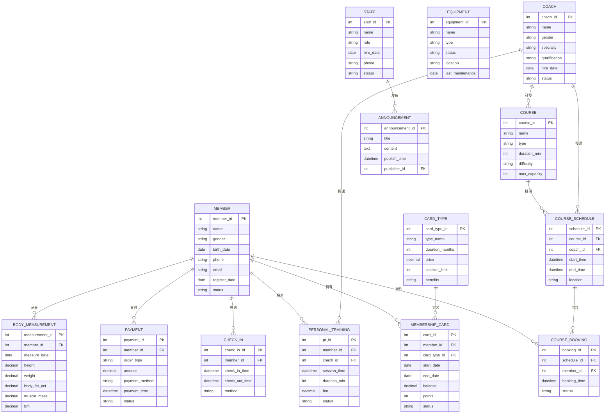

```mermaid
erDiagram
    MEMBER {
        int member_id PK
        string name
        string gender
        date birth_date
        string phone
        string email
        date register_date
        string status
    }
    CARD_TYPE {
        int card_type_id PK
        string type_name
        int duration_months
        decimal price
        int session_limit
        string benefits
    }
    MEMBERSHIP_CARD {
        int card_id PK
        int member_id FK
        int card_type_id FK
        date start_date
        date end_date
        decimal balance
        int points
        string status
    }
    COACH {
        int coach_id PK
        string name
        string gender
        string specialty
        string qualification
        date hire_date
        string status
    }
    COURSE {
        int course_id PK
        string name
        string type
        int duration_min
        string difficulty
        int max_capacity
    }
    COURSE_SCHEDULE {
        int schedule_id PK
        int course_id FK
        int coach_id FK
        datetime start_time
        datetime end_time
        string location
    }
    COURSE_BOOKING {
        int booking_id PK
        int schedule_id FK
        int member_id FK
        datetime booking_time
        string status
    }
    PERSONAL_TRAINING {
        int pt_id PK
        int member_id FK
        int coach_id FK
        datetime session_time
        int duration_min
        decimal fee
        string status
    }
    CHECK_IN {
        int check_in_id PK
        int member_id FK
        datetime check_in_time
        datetime check_out_time
        string method
    }
    PAYMENT {
        int payment_id PK
        int member_id FK
        string order_type
        decimal amount
        string payment_method
        datetime payment_time
        string status
    }
    BODY_MEASUREMENT {
        int measurement_id PK
        int member_id FK
        date measure_date
        decimal height
        decimal weight
        decimal body_fat_pct
        decimal muscle_mass
        decimal bmi
    }
    EQUIPMENT {
        int equipment_id PK
        string name
        string type
        string status
        string location
        date last_maintenance
    }
    STAFF {
        int staff_id PK
        string name
        string role
        date hire_date
        string phone
        string status
    }
    ANNOUNCEMENT {
        int announcement_id PK
        string title
        text content
        datetime publish_time
        int publisher_id FK
    }
    MEMBER ||--o{ MEMBERSHIP_CARD : "持有"
    CARD_TYPE ||--o{ MEMBERSHIP_CARD : "定义"
    MEMBER ||--o{ COURSE_BOOKING : "预约"
    COURSE_SCHEDULE ||--o{ COURSE_BOOKING : "包含"
    COURSE ||--o{ COURSE_SCHEDULE : "排期"
    COACH ||--o{ COURSE_SCHEDULE : "授课"
    COACH ||--o{ COURSE : "可授"
    MEMBER ||--o{ PERSONAL_TRAINING : "报名"
    COACH ||--o{ PERSONAL_TRAINING : "授课"
    MEMBER ||--o{ CHECK_IN : "签到"
    MEMBER ||--o{ PAYMENT : "支付"
    MEMBER ||--o{ BODY_MEASUREMENT : "记录"
    STAFF ||--o{ ANNOUNCEMENT : "发布"

```